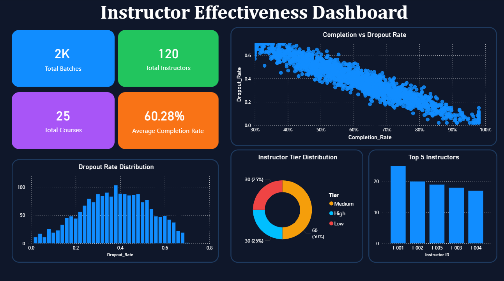

# 🎓 Instructor Effectiveness Modeling — EdTech

> Predict instructor performance tiers (Low / Medium / High) using batch-level engagement and learning metrics.

[](https://instructor-effectiveness-modeling.streamlit.app/)
[](https://python.org)
[](https://scikit-learn.org)

---

## 📌 Problem Statement

In EdTech platforms, identifying whether an instructor is performing well is critical for student success and business growth. This project builds an end-to-end system to:

1. **Define** an Instructor Effectiveness Score from batch-level data
2. **Classify** instructors into Low / Medium / High tiers
3. **Deploy** a live prediction app for real-time evaluation

---

## 🖥️ Live Demo

🔗 **Streamlit App:** [instructor-effectiveness-modeling.streamlit.app](https://instructor-effectiveness-modeling.streamlit.app/)

Enter batch metrics → Get tier prediction + confidence scores + pillar breakdown instantly.

---

## 📊 Power BI Dashboard



---

## 📁 Project Structure

```
instructor-effectiveness-modeling/
├── data/
│   └── instructor_effectiveness_dataset.csv
├── notebook/
│   └── instructor_effectiveness_modeling.ipynb
├── app/
│   ├── app.py
│   ├── random_forest_model.pkl
│   └── scaler.pkl
├── dashboard/
│   └── EdTech.pbix
│   └── dashboard_preview.png
├── requirements.txt
└── README.md
```

---

## 🧠 Approach

### Step 1: Effectiveness Score Design

Rather than using raw columns directly, features were grouped into **3 pillars**:

| Pillar | Columns | Weight |
|--------|---------|--------|
| Learning Outcome | completion_rate, dropout_rate (inv), avg_score_improvement, avg_quiz_score | 40% |
| Engagement | avg_watch_time, assignment_submission_rate, forum_activity_rate | 35% |
| Instructor Quality | avg_feedback_score, feedback_response_rate | 25% |

Weights were justified using EDA findings — dropout_rate had -0.95 correlation with completion_rate, and forum_activity had the weakest correlation with outcomes.

### Step 2: Tier Assignment

- Aggregated 2000 batch rows → 120 instructor-level rows using mean
- Used **25th and 75th percentile cutoffs** for balanced tier classes (60 Medium / 30 High / 30 Low)

### Step 3: ML Classification

Trained and compared 3 models on the same train-test split (80/20):

| Model | Accuracy |
|-------|----------|
| ✅ Random Forest | **96%** |
| Gradient Boosting | 88% |
| Logistic Regression | 79% |

Random Forest selected as final model — **zero critical misclassifications** (no Low predicted as High or vice versa).

### Step 4: Feature Importance

Top features identified by the model:

| Feature | Importance |
|---------|------------|
| dropout_rate_inv | 0.283 |
| pillar_learning | 0.202 |
| completion_rate | 0.168 |

Consistent with EDA correlation heatmap findings.

---

## 🛠️ Tech Stack

- **Python** — pandas, numpy, scikit-learn, matplotlib, seaborn
- **Streamlit** — live prediction app
- **Power BI** — interactive dashboard
- **Jupyter Notebook** — full analysis and modeling

---

## 🚀 Run Locally

```bash
git clone https://github.com/Vansh7206/instructor-effectiveness-modeling
cd instructor-effectiveness-modeling
pip install -r requirements.txt
streamlit run app/app.py
```

---

## 👤 Author

**Vansh Chandan**
[LinkedIn](https://linkedin.com/in/vansh-chandan-875a373a3) • [GitHub](https://github.com/Vansh7206) • vchandan0702@gmail.com